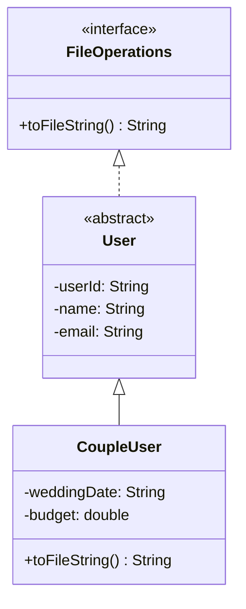
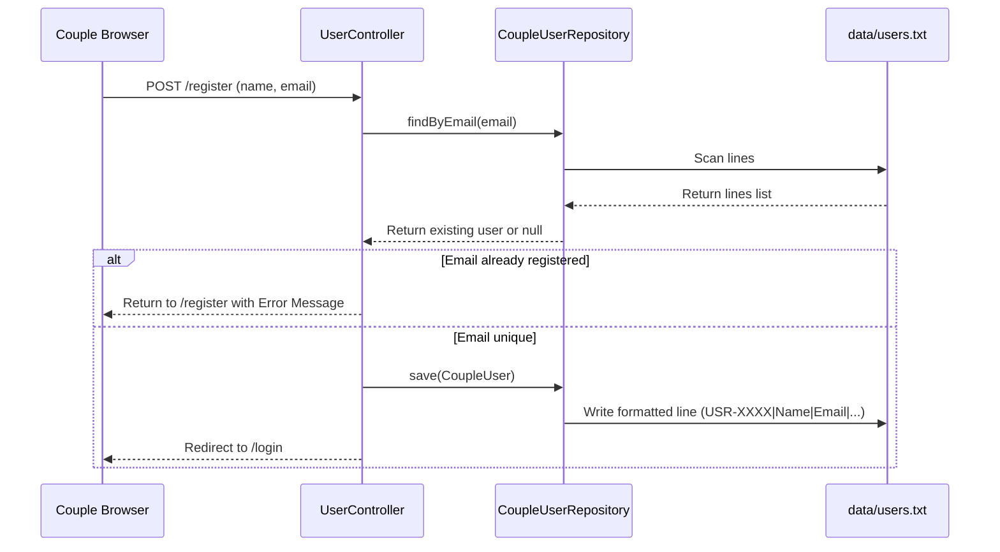

# 💍 Tie The Tech (TTT) - Wedding Planning Management System


-red.svg?style=for-the-badge)


Welcome to the enterprise-grade architectural and system documentation for **Tie The Tech (TTT)**, a highly-decoupled Wedding Planning Management System. Developed as a Year 1 Semester 2 project at the Sri Lanka Institute of Information Technology (SLIIT), this system is specifically designed to showcase core **Object-Oriented Programming (OOP)** principles while adhering to strict academic constraints of database-free, pure file-based (`java.io`) persistence.

---

## 🏗️ Core Tech Stack & Frameworks

The system is built on a modern Java foundation, leveraging Spring Boot for application lifecycle management and MVC routing, combined with custom File I/O persistence to ensure zero database dependencies.

* **Language Runtime:** Java 17 (LTS)
* **Framework:** Spring Boot 3.2.4 (leveraging Spring MVC and embedded Apache Tomcat 10.1)
* **Presentation Layer:** JavaServer Pages (JSP) + JSTL (Jakarta Standard Tag Library)
* **Styling & Assets:** Vanilla CSS, Bootstrap 5.3, and Bootstrap Icons 1.11
* **Persistence Layer:** Custom Local File Persistence (`java.io`) using flat, pipe-delimited (`|`) text files
* **Build System:** Maven 3.x

---

## 📂 Directory Structure & Decoupled Architecture

The repository enforces modular separation of concerns. Each of the core features is isolated in its own sub-package containing its private MVC Controller, Repository, and Model structures, achieving **high cohesion** and **loose coupling**.

```text
Wedding-planner/
├── data/                            # Local File-Based Databases (.txt files)
│   ├── users.txt
│   └── vendors.txt
├── src/main/java/com/ttt/
│   ├── TttApplication.java          # Spring Boot Application Entry Point
│   ├── HomeController.java          # Multi-module routing landing controller
│   ├── shared/                      # System-wide Shared Abstractions
│   ├── component01/                 # User Management (Lead: Reshan Athalsha)
│   ├── component02/                 # Vendor Management
│   ├── component03/                 # Booking & Payment Core
│   ├── component04/                 # Interactive Planning Tools
│   ├── component05/                 # Ratings & Review System
│   └── component06/                 # Admin Dashboard & Aggregation
└── src/main/webapp/WEB-INF/jsp/     # Encapsulated JSP Views
```

---

## ⚙️ Primary Business Logic & Data Flows

### A. Modular Data Persistence
All domain models implement the shared `FileOperations` interface to handle serialization without a traditional SQL database.



### B. User Management System (Component 01)
Demonstrates Abstraction, Polymorphism, and State Encapsulation across user sessions.



---

## 🚀 Local Setup & Run Instructions
To run this application locally on your workstation, follow these steps:

1. **Clone the repository:**
   ```bash
   git clone https://github.com/Reshan-Athalsha/Wedding-planner.git
   ```

2. **Navigate to the project directory:**
   ```bash
   cd Wedding-planner
   ```

3. **Build the application using Maven:**
   ```bash
   mvn clean install
   ```

4. **Run the Spring Boot server:**
   ```bash
   mvn spring-boot:run
   ```

5. **Access the application:**
   Open your web browser and navigate to `http://localhost:8080`.

---

## 🛡️ Future Optimizations & Technical Roadmap
* **Security Patching:** Implement input sanitization utility to prevent delimiter injection (`|`) in flat-file storage.
* **Testing Implementation:** Integrate JUnit 5 for file read/write validation.
* **Concurrency Management:** Implement `ReentrantReadWriteLock` for thread-safe `.txt` database updates.
