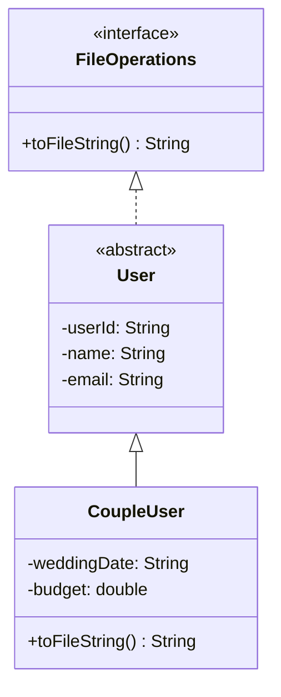
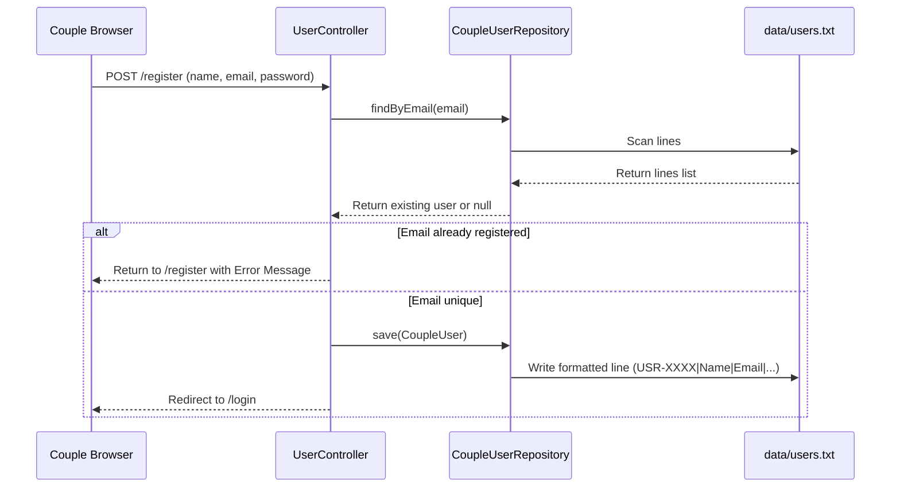

# Architectural & Functional Overview: Tie The Tech (TTT)

Welcome to the enterprise-grade architectural and system documentation for **Tie The Tech (TTT)**, a complete, highly-decoupled Wedding Planning Management System. This project is specifically designed to showcase core **Object-Oriented Programming (OOP)** principles while adhering to academic constraints of database-free, pure file-based (`java.io`) persistence.

---

## 1. Core Tech Stack, Dependencies & Frameworks

The system is built on a modern Java foundation, leveraging Spring Boot for application lifecycle management and MVC routing, combined with custom File I/O persistence to ensure zero database dependencies.

### Core Stack Breakdown
* **Language Runtime:** Java 17 (LTS)
* **Framework:** Spring Boot 3.2.4 (leveraging Spring MVC for routing and embedded Apache Tomcat 10.1 as the servlet container)
* **Presentation Layer:** JavaServer Pages (JSP) + JSTL (Jakarta Standard Tag Library)
* **Styling & Assets:** Vanilla CSS, Bootstrap 5.3, and Bootstrap Icons 1.11
* **Persistence Layer:** Custom Local File Persistence (`java.io`) using flat, pipe-delimited (`|`) text files
* **Build System:** Maven 3.x

### Maven Dependency Tree (`pom.xml`)
The system strictly minimizes external dependencies to keep the bundle lightweight and compilable on any baseline workstation:

| Group ID | Artifact ID | Version | Description / Purpose |
| :--- | :--- | :--- | :--- |
| **`org.springframework.boot`** | `spring-boot-starter-web` | `3.2.4` | Core MVC framework, embedded Tomcat, and Jackson JSON parsers. |
| **`org.apache.tomcat.embed`** | `tomcat-embed-jasper` | *Managed* | Embedded Tomcat compiler to translate JSPs into executable Servlets. |
| **`jakarta.servlet.jsp.jstl`** | `jakarta.servlet.jsp.jstl-api` | *Managed* | Standard JSP tags interface for flow control, loops, and formatting. |
| **`org.glassfish.web`** | `jakarta.servlet.jsp.jstl` | *Managed* | Concrete JSTL engine implementation under the Jakarta namespace. |

---

## 2. Directory Structure & Decoupled Architecture

The repository enforces modular separation of concerns. Each of the six core features is isolated in its own sub-package containing its private MVC Controller, Repository, and Model structures, achieving **high cohesion** and **loose coupling**.

```text
Wedding-planner/
├── data/                            # Local File-Based Databases (.txt files)
│   ├── users.txt
│   ├── vendors.txt
│   ├── bookings.txt
│   ├── payments.txt
│   ├── reviews.txt
│   └── tasks.txt
├── docs/                            # System & Architecture Documentation
│   └── architecture_overview.md
├── src/main/
│   ├── java/com/ttt/
│   │   ├── TttApplication.java       # Spring Boot Application Entry Point
│   │   ├── HomeController.java       # Multi-module routing landing controller
│   │   ├── shared/                   # System-wide Shared Abstractions
│   │   │   └── FileOperations.java   # Interface contract for local serialization
│   │   ├── component01/              # 1. Couple/User Management
│   │   │   ├── controller/           # UserController (Session routing & profiles)
│   │   │   ├── model/                # User (abstract), CoupleUser (concrete)
│   │   │   └── repository/           # CoupleUserRepository (file-based user CRUD)
│   │   ├── component02/              # 2. Vendor Management
│   │   │   ├── controller/           # VendorController (Filtering & profiles)
│   │   │   ├── model/                # Vendor (base), Venue/Photography/Catering subclasses
│   │   │   └── repository/           # VendorRepository (flat-file deserialization)
│   │   ├── component03/              # 3. Booking & Payment Core
│   │   ├── component04/              # 4. Interactive Planning Tools
│   │   ├── component05/              # 5. Ratings & Review System
│   │   └── component06/              # 6. Admin Dashboard & Aggregation
│   └── webapp/
│       └── WEB-INF/jsp/              # Safe JSP Views (Not exposed publicly)
│           ├── index.jsp             # Main TTT Dashboard / Landing
│           ├── oop.jsp               # OOP Principles Interactive Legend
│           ├── component01/          # Register, Login, Profile Views
│           ├── component02/          # Browse Vendors, Details, Forms
│           └── component05/          # Premium Glassmorphic Review UI
```

---

## 3. Primary Business Logic & Data Flows

### A. Modular Data Persistence & Shared Serialization Contract
All domain models implement the shared [FileOperations](file:///c:/Users/athal\Desktop\GitHub\Wedding-planner\src\main\java\com\ttt\shared\FileOperations.java) interface:



When a Repository's `.save(entity)` is invoked:
1. The Repository loads all existing records from the corresponding `.txt` file inside `data/` using a `BufferedReader`.
2. It parses lines by splitting them using the pipe delimiter (`|`).
3. If the Entity's unique ID matches an existing record, it updates the record in-memory. Otherwise, it appends the new entity.
4. It rewrites the entire flat-file database using a `BufferedWriter`, invoking the polymorphic `.toFileString()` method of each model.

---

### B. User Management System (Component 01)
Demonstrates **Abstraction, Polymorphism, and State Encapsulation** across user sessions.



---

### C. Ratings & Reviews Coordination (Component 05)
This module showcases a sophisticated model-level abstraction utilizing the abstract `canEdit()` business rule.

```mermaid
graph TD
    A[User Submits Review Form] --> B{Review Type?}
    B -->|Verified Couple| C[Instantiate VerifiedReview]
    B -->|General Public| D[Instantiate PublicReview]
    
    C --> E[canEdit returns true]
    D --> F[canEdit returns false]
    
    E --> G[JSP renders "Edit Button" dynamically]
    F --> H[JSP hides "Edit Button"]
    
    I[Direct URL Access to /edit/ID] --> J{Invoke review.canEdit}
    J -->|True| K[Render Edit Form]
    J -->|False| L[Redirect to /reviews?error=unauthorized]
```

* **Abstraction:** The [Review](file:///c:/Users/athal\Desktop\GitHub\Wedding-planner\src\main\java\com\ttt\component05\model\Review.java) base class is abstract and mandates a `canEdit()` contract.
* **Polymorphism:** [VerifiedReview](file:///c:/Users/athal\Desktop\GitHub\Wedding-planner\src\main\java\com\ttt\component05\model\VerifiedReview.java) overrides it to return `true` (editable feedback), while [PublicReview](file:///c:/Users/athal\Desktop\GitHub\Wedding-planner\src\main\java\com\ttt\component05\model\PublicReview.java) overrides it to return `false` (immutable feedback).
* **Decoupled Security:** The controller acts as the gatekeeper, resolving the permission dynamically at runtime without hardcoded type-checking.

---

### D. Component 06: Decoupled Dashboard Analytics
A standard risk in modular projects is **circular package dependencies** (e.g., Component 6 imports all of Components 1-5's repository classes, creating a tight web of imports). 

To prevent this, the **Admin Dashboard (Component 06)** aggregates data using a highly-efficient **decoupled stream reader**:
```java
private long countLines(String filePath) {
    Path path = Paths.get(filePath);
    if (!Files.exists(path)) return 0;
    try (Stream<String> lines = Files.lines(path)) { 
        return lines.filter(l -> !l.trim().isEmpty()).count(); 
    } catch (Exception e) { 
        return 0; 
    }
}
```
Instead of calling foreign repository classes, the [AdminController](file:///c:/Users/athal\Desktop\GitHub\Wedding-planner\src\main\java\com\ttt\component06\controller\AdminController.java) reads the flat text database files directly. This isolates Component 06 completely from other component code compiles, allowing it to act as a standalone, zero-coupling reporting engine!

---

## 4. Testing Gaps, Technical Debt & Optimization Plan

While the design is exceptionally well-suited for academic execution, moving this architecture towards an enterprise standard reveals several areas of technical debt and structural optimization.

### A. Testing Gaps
> [!WARNING]
> **Total Absence of Automated Testing**
> The repository currently has zero unit tests, integration tests, or UI test coverage. All verification is handled via manual browser testing.
* **Mitigation Plan:**
  1. Introduce **JUnit 5** and **AssertJ** for core repository logic (validating file read/write operations).
  2. Implement **Spring MockMvc** tests inside the controller packages to validate HTTP endpoints, session behavior, and redirect parameters automatically.

### B. Concurrency Risks
> [!IMPORTANT]
> **Lack of Read/Write Synchronization**
> Multiple clients accessing the site simultaneously will cause concurrency race conditions. If two users submit records at the exact same millisecond, the local repository will perform overlapping read/write loops, resulting in complete file truncation or **data corruption**.
* **Mitigation Plan:**
  1. Add `synchronized` keywords or Java `ReentrantReadWriteLock` blocks around the `.save()` and `.findAll()` methods in the repository layer to block overlapping resource locks.
  2. Transition repositories to write to a temporary file first, then atomically rename it (using `Files.move`) to avoid empty file corruptions if a write fails mid-stream.

### C. Validation & Security Vulnerabilities
> [!CAUTION]
> **Input Delimiter Injection & XSS Vulnerability**
> * **Delimiter Injection:** Since data is serialized using the pipe character (`|`), a user entering a pipe in their name or description will offset the CSV parsing index on the next read, breaking user credentials or corrupting profiles. *(Although some reviews filter it out, global sanitization is absent).*
> * **Cross-Site Scripting (XSS):** Raw text saved to files is rendered directly in JSPs without escaping, leaving the application open to local XSS injections if someone enters `<script>alert('hack')</script>` in a comment.
* **Mitigation Plan:**
  1. Enforce a global interceptor or utility function to filter out or HTML-encode special delimiters before saving.
  2. Switch JSP rendering tags to use the JSTL `<c:out value="${var}" />` which automatically sanitizes variables, preventing script injection.

### D. Authentication Architecture
> [!NOTE]
> **Repetitive Session Guards**
> Route protection is handled in an ad-hoc manner in every single controller method via manual session checks (`session.getAttribute("userId") == null`). This is highly repetitive and error-prone.
* **Mitigation Plan:**
  1. Refactor route protection by declaring a central Spring **`HandlerInterceptor`** or introducing standard Spring Security filters to block unauthorized access to sub-folders (like `/planning/**` or `/admin/**`) globally.
